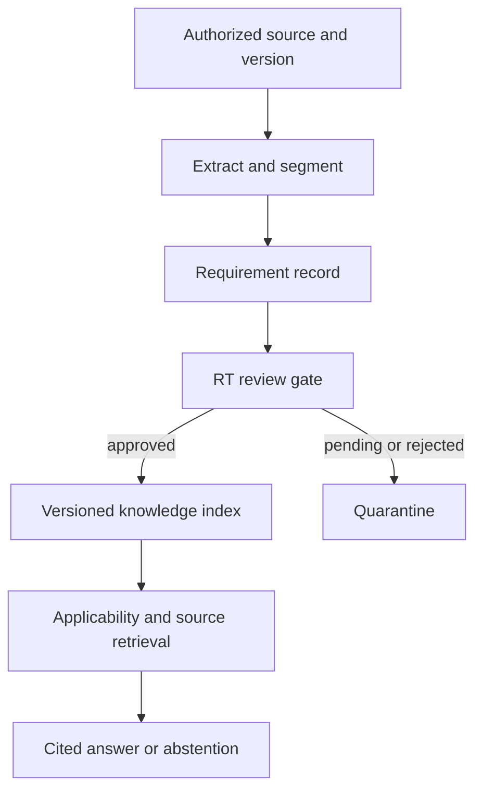

# Proposed architecture

This is a target design, not a claim about the demo implementation. The demo reads a small synthetic JSON file and demonstrates one approval gate.

## Source pipeline

Record the issuing body, official title, identifier, publication date, effective date, amendment relationships, source URL or controlled document identifier, access rights, retrieval timestamp, and content hash. A changed hash triggers re-review rather than silently replacing an approved record.

Keep each requirement small enough to review independently. Preserve the exact location in the original source in the private inventory. Distinguish source text from the team's interpretation; record who made the interpretation and when.

## Answer pipeline

1. Identify the user's question, vehicle type, inspection service, and relevant date. Ask for missing context when it determines applicability.
2. Retrieve only records approved for the applicable version, date, vehicle, and service.
3. Separate official regulations from internal procedures; show both roles in the evidence trail.
4. Detect conflicts, superseded sources, and missing evidence. Escalate rather than guess.
5. Answer with a source identifier and location, the applicability conditions, and the scope of the conclusion.

Technical decisions remain subject to the RT and the current controlled procedures. A retrieved passage alone does not authorize an inspection outcome.

## Demo boundary

`src/assistant.py` implements a small deterministic demonstration of status lookup and abstention. It does not ingest PDFs, determine legal applicability, query a vector database, call an LLM, or generate technical inspection instructions.
